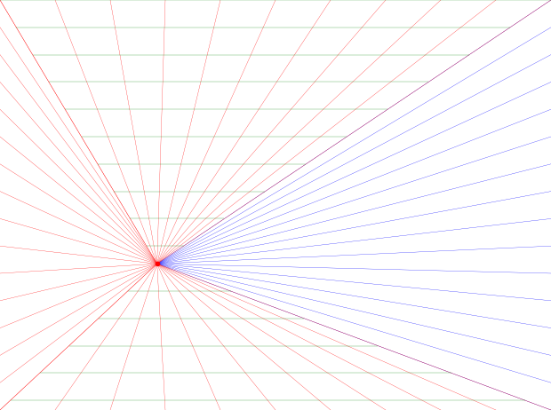

# App-Grafica-lineas-de-fuga

Este es un código de prática en el que se busca generar imagenes png transparentes con puntos de fuja para ayudar a dibujantes.

<h4>Imagen de la app:</h4>

<h4>Imagen de salida:</h4>
